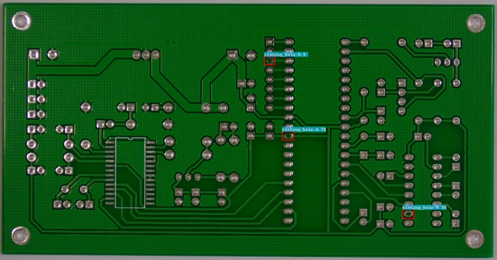
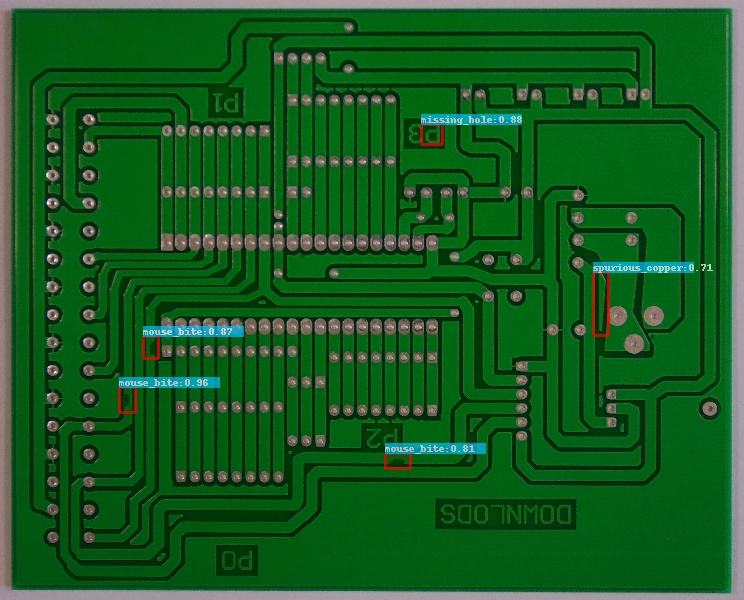
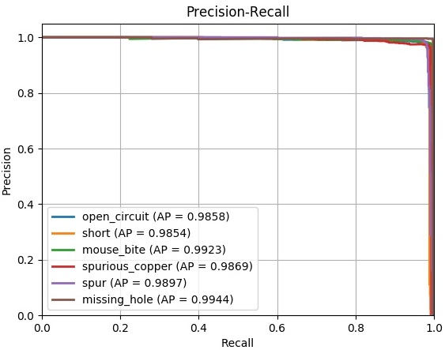

# PCB-defect-detection-JY
## Note
This project code is modified based on https://github.com/Ixiaohuihuihui/Tiny-Defect-Detection-for-PCB. I have only made minor changes so that it would be more readable and executable for students whose computers don't have GPUs and need specific details on how to implement this wonderful project and some common problems that might be encountered during the process. Therefore if you have GPU on your laptop and would like to learn more about this project you could check the original website.


## Some Instructions

If you use the code, please access this paper and cite: 
Ding, Runwei, et al. "TDD-Net: A Tiny Defect Detection Network for Printed Circuit Boards." CAAI Transactions on Intelligence Technology (https://ieeexplore.ieee.org/document/8757220)(2019).

Chinese Blog: https://blog.csdn.net/dlh_sycamore/article/details/87886198


You can follow the steps below to help you work out.

## Step 1: Download PCB Defect Dataset
The Open Lab on Human Robot Interaction of Peking University has released the PCB defect dataset. If you need to do experiments on this dataset, please contact the dataset author. 

You can download at http://robotics.pkusz.edu.cn/resources/dataset/. or https://www.dropbox.com/s/32kolsaa45z2mpj/PCB_DATASET.zip?dl=0


6 types of defects are made by photoshop, a graphics editor published by Adobe Systems. The defects defined in the dataset are: missing hole, mouse bite, open circuit, short, spur, and spurious copper. 
For example:

.png)

## Step 2: Download model
Please download [resnet50_v1](http://download.tensorflow.org/models/resnet_v1_50_2016_08_28.tar.gz)、[resnet101_v1](http://download.tensorflow.org/models/resnet_v1_101_2016_08_28.tar.gz) pre-trained models on Imagenet, put it to `$PATH_ROOT/data/pretrained_weights`. 


## Step 3: Setup Development Environment
Install [python3.6](https://www.python.org/downloads/release/python-360/) and packages:
1. tensorflow1.14.0
```
python3.6 -m pip install tensorflow=1.14.0
```

2. [tfplot](https://github.com/wookayin/tensorflow-plot)
```
python3.6 -m pip install tensorflow-plot
```

3. [opencv(cv2)](https://pypi.org/project/opencv-python/)  
```
python3.6 -m pip install opencv-python
```

4. others: numpy, Cython, Image, sklearn  **(TODO: may have others: time, os, ...)**
```
python3.6 -m pip install PACKAGE_name
```
In the original project, the environment is 1.python2.7 (anaconda recommend) 2、CUDA Version 8.0.44 , CUDNN=5.1.10 (For GPU user) 3、opencv(cv2) 4、tfplot 5、tensorflow == 1.121. I changed the codes a little and it's now compilable for CPU user. If you have GPU on your laptop and would like to use it, you could also check the original website for this project.

## Step 4: Change Working Directory
1. `$PATH_ROOT/⁨libs⁩/configs⁩/cfgs.py`: line37, change test_annotate_path to your own path
2. `$PATH_ROOT/output/trained_weights/FPN_Res101_0117_OHEM/checkpoint`: change the two working directory to your own path  **(TODO: maybe need to specify how to change it with emacs?)**

## Step 5: Image Inference
Make a new folder to put images after detecting, and get the working directory of your downloaded dataset (`data_dir`) and the new folder (`save_dir`). Run the code below, and you will find the detected results of images in the new folder. Here the images should all be extracted out from different folders. That is to say you need to confirm that the files under path '/PATH/TO/THE/TO/BE/DETECTED/IMAGES/' (depends on your PCB_DATASET directory) should be jpg files but not folders.(Missing_hole,Spur,...). After extracting out the jpg files directly under your image path, you could run the following commands in your terminal.
```
cd $PATH_ROOT/tools
python3.6 inference.py --data_dir='/PATH/TO/THE/TO/BE/DETECTED/IMAGES/' 
                       --save_dir='/PATH/TO/SAVE/THE/DETECTED/IMAGES/'
```

Here for simplicity, if you find its too long to run all the images in PCB_DATASET, you could first use demo_backup in the tools folder I provided, which is a sample of the images from PCB_DATASET. 

## Step 6: Inference Evaluation
Run the code below, you will get the precision, recall and AP of per defect type. Again, you could use the demo to run first. To get the corresponding demo test_annotation for demo model evaluation , you could check test_annotation_demo_creation.ipynb and follow the codes. Make a new directory called test_annotation in the tools folders and run codes in test_annotation_demo_creation.ipynb to get the corresponding *.xml files for demo test_annotation.
```  
cd $PATH_ROOT/tools
python3.6 eval.py --eval_imgs='/PATH/TO/THE/TO/BE/EVALED/IMAGES/'  
               --annotation_dir='/PATH/TO/TEST/ANNOTATION/'
               --GPU='0'
```   

## Some results 
All demo results can be checked in the demo_results folder.



## The Precision and Recall curve (PR)

